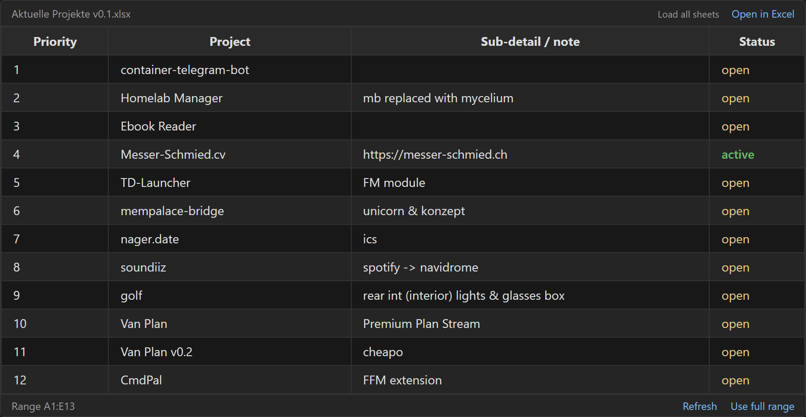
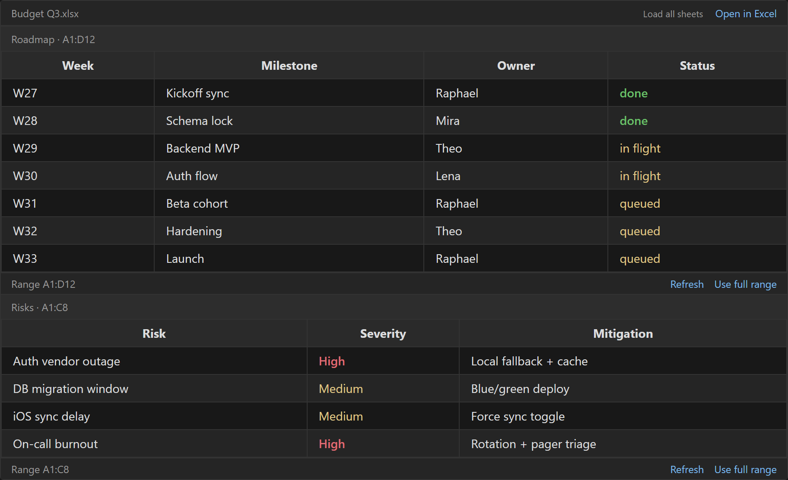
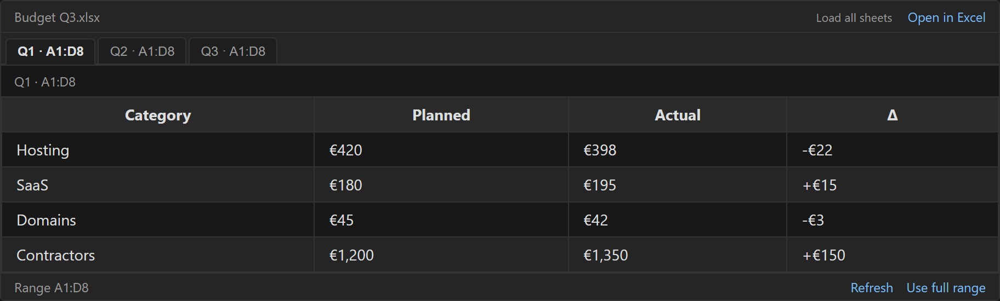
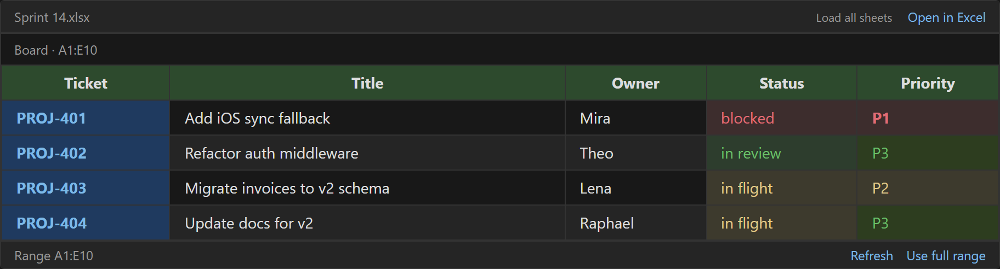

# XLSX Block

Embed live `.xlsx` and `.csv` data in your Obsidian notes — with cell formatting, multi-range stacking, sticky headers, and one-click "Open in Excel".



## Features

- **code-block syntax** — drop `\`\`\`spreadsheet` blocks anywhere in a note
- **live data** — values reflect your xlsx on disk; click `Refresh` after editing
- **multi-range** — comma-separate ranges inside one block to stack or tab several views
- **cell formatting** — background fill + text color from the xlsx render inline
- **sticky header** — column titles stay visible when the page scrolls past the table
- **horizontal scroll** — wide tables get a side scroll bar instead of squashed columns
- **"Load all sheets"** — one click to render every sheet in the workbook as a sub-block
- **"Open in Excel"** — hand off to your default xlsx handler (Excel, Numbers, Sheets) from Obsidian
- **mobile-safe** — works on iOS / Android; the iOS path-module crash is patched (no Node `path.dirname` calls)
- **no JS in your note** — your markdown stays pure; the plugin reads the xlsx file at render time

## Screenshots

### Multi-range, stacked

Multiple sheets / ranges in one block, stacked top to bottom. The `,` separator splits ranges.



```spreadsheet
Budget Q3.xlsx(Roadmap!A1:D12; Risks!A1:C8)
```

### Multi-range, tabbed

Same data, tabs across the top. Add `; mode=tabbed` to switch from stacked to tabbed.



```spreadsheet
Budget Q3.xlsx(Q1!A1:D8, Q2!A1:D8, Q3!A1:D8; mode=tabbed)
```

### Cell formatting

Cell background fill and text color carry over from the xlsx. Opt out with `; formatting=off`.



## Code-block syntax

````
```spreadsheet
filename.xlsx(range1, range2; option1=value, option2=value)
```
````

| piece | meaning |
|---|---|
| `filename.xlsx` | the xlsx/csv file in the same folder as the note (or relative path) |
| `range1, range2` | one or more ranges, separated by `,`. each is `A1:B2` or `Sheet!A1:B2` |
| `;` | separates ranges from options |
| `option=value` | `mode=tabbed\|stacked` (default `stacked`) or `formatting=on\|off` (default `on`) |

**Examples**

```
Aktuelle Projekte v0.1.xlsx(Projekte!A1:E13)              — single range
Aktuelle Projekte v0.1.xlsx(Projekte!A1:E5; Projekte!A10:E20) — two ranges from same sheet
Budget Q3.xlsx(Q1!A1:D8, Q2!A1:D8, Q3!A1:D8; mode=tabbed)  — three sheets, tabbed
Sheet1.csv(A1:B2; formatting=off)                           — csv, no cell styles
```

## Installation

### From the Obsidian Community Plugins (once approved)

`Settings → Community plugins → Browse → search "XLSX Block" → Install → Enable`.

### Manual / via BRAT (until community approval lands)

1. Install [BRAT](https://github.com/TfTHacker/obsidian42-brat).
2. `BRAT → Add Beta plugin → paste: https://github.com/BigHoss/obsidian-xlsx-block`
3. Install + enable.

## Per-block actions

| action | what it does |
|---|---|
| **Open in Excel** | hands the xlsx off to your OS default handler (Excel / Numbers / Sheets / WPS) |
| **Load all sheets** | re-reads the file and renders every sheet as its own stacked sub-block, full range |
| **Refresh** | re-reads the same range from disk (for when you edited the xlsx since Obsidian opened) |
| **Use full range** | switches the current view to the worksheet's max range (auto-detected from `!ref`) |

Clicking `Load all sheets` or `Refresh` does not change the note's source — just the rendered output. Reload the note to revert.

## Limitations

- sheet names containing a literal `,` break the range separator — rename the sheet or use `[...]` quoting (coming)
- `Refresh` is manual; the plugin does not watch the xlsx for external edits
- Excel frozen panes are not preserved (SheetJS does not expose them) — but the sticky `<th>` keeps the header row visible while you scroll the note

## Development

```sh
npm install
npm run dev       # watch mode
npm run build     # production bundle to main.js
```

## License

MIT — see [LICENSE](LICENSE).
